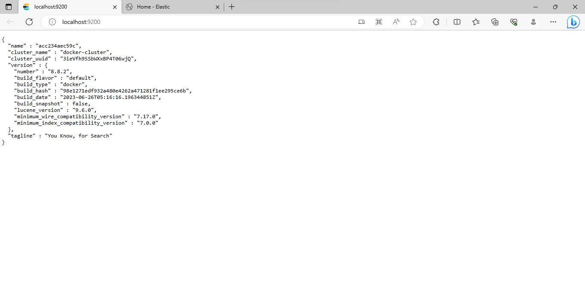
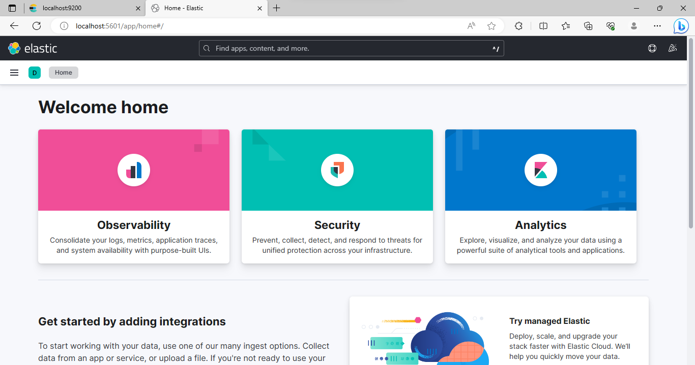
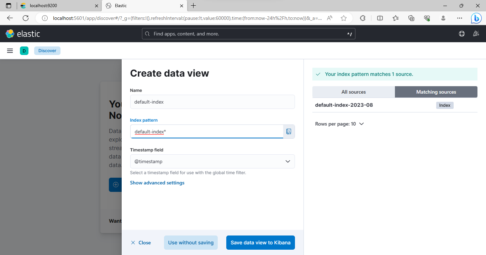
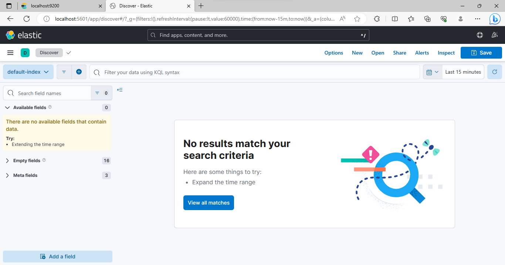
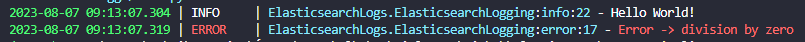
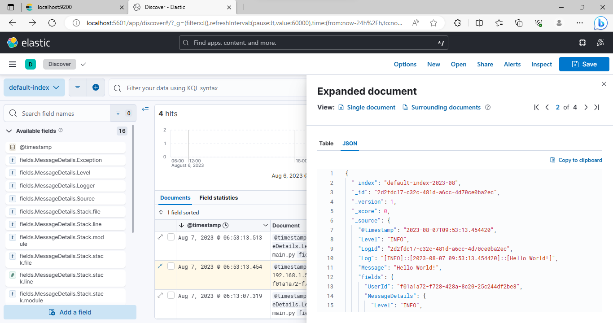
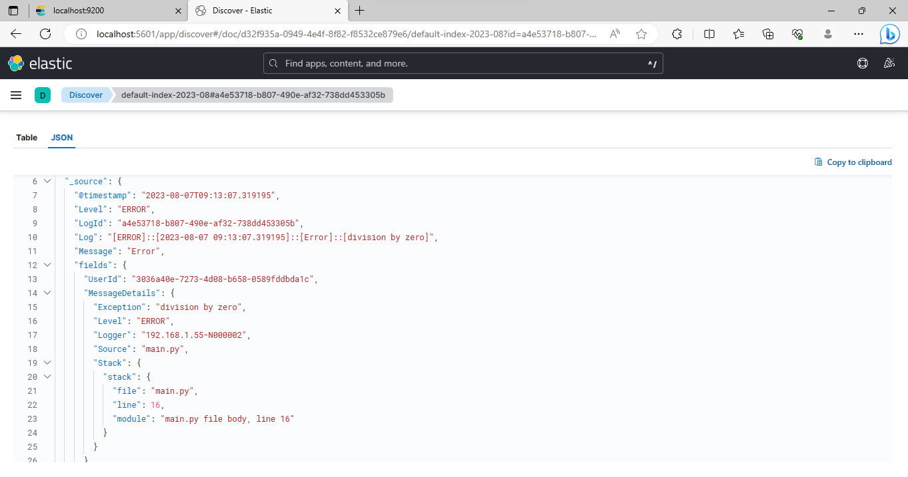

# Elastichsearch Logging Sender

---

## Getting Started

- Clone this repository:
  ```Shell
  git clone https://github.com/GabrielZuany/ElasticSearchLoggs.git
  ```

- Install and run [Docker](https://docs.docker.com/engine/install/) in your machine (for local development).

- Go to elastic-config and run the compose file to pull the necessary images:
  ```Shell
  cd elastic-config
  docker compose up
  ```

- Then await a few seconds and check the 2 urls below:
  - http://localhost:9200/
  - http://localhost:5601/
 
- You must see these two windows:
  - Elastic response:
    
  - ---
  - Elastic Interface:
    
  - ---

- So now your environment is setted up and ready to receive loggings from your Python application!
---

## Working with Data Views and Indexes:

- Creating a Data View based in an index pattern:
    

    

- Check your new data view and associated indexes!
    

---

## Sending Loggings to Kibana

- Create and activate the Virtual Environment:
    ```Shell
    python -m venv .venv
    .venv/Scripts/Activate.ps1
    ```

- Install the requirements:
    ```Shell
    pip install -r requirements.txt
    ```

- Import the ElasticSearchLogging class to your source code and create an object to manipulate loggings:
  ```Python
  import ElasticsearchLogs.ElasticsearchLogging as esl

  logging_sender = esl.ElasticsearchLogging(
    host="localhost",
    port=9200
    index=DEFAULT_INDEX
  )
  ```

- Once your setted up the host and port (and also index if you already have one), you can just send logs to Kibana:
    ```Python
    import uuid
    
    logger.info(message="Hello World!", user_id=uuid.uuid4())

    try:
        res = 1 / 0
    except Exception as e:
        logger.error(message="Error", user_id=uuid.uuid4(), exception=e)
    ```

- Your loggings also going to be writen in console.

- Local loggings (Console):
    
- ---
- Elastic loggings:
    
    
- ---

---

## License

- Licensed under [license]()
---

### Final Considerations
- Made by me (Gabriel Zuany Duarte Vargas)
- Feel free to sugest new features and fix non mapped bugs
- Last update: 07/08/2023

---
